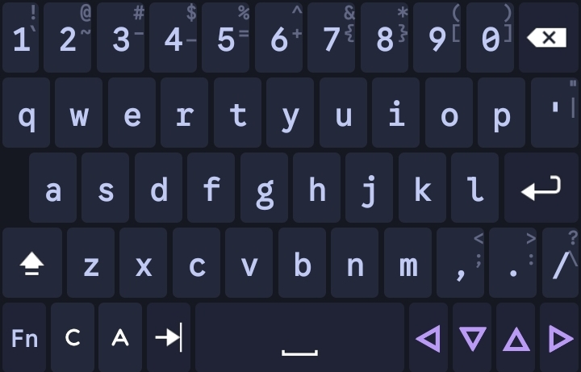

# Hacker Keyboard: Tokyo Night

A modernization project of the legendary Hacker's Keyboard, bringing aesthetic and modern Android UX to the most powerful soft keyboard ever made.

[CHANGELOG](CHANGELOG.md)

## 📜 The History: From 2011 to Today

Hacker's Keyboard was originally developed in 2011, based on the Android 2.3 (Gingerbread) AOSP keyboard. It became the gold standard for power users, developers, and sysadmins due to its full 5-row layout, working Tab/Ctrl/Esc keys, and essential arrow keys for SSH and terminal usage.

### The Modernization Journey
This project transforms the "ancient" Gingerbread-style UI into a professional, data-driven modernization:
- **Phase I**: Purged 14+ inconsistent legacy themes and replaced them with the **Tokyo Night** design system.
- **Phase II**: Overhauled the core rendering logic from static bitmap nine-patches to a dynamic, attribute-driven XML system.
- **Phase III**: Refined interaction design with fluid animations, designer typography, and "AnySoft" style continuous stroke popups.

## ✨ Key Features (Modernized)

### 🎨 Tokyo Night Design System
Integrated 4 high-contrast variants based on the popular Neovim color scheme:
- **Storm** (Default): A balanced, deep blue-grey.
- **Night**: Darker, more intense tones for AMOLED/OLED and low-light.
- **Moon**: A slightly softer, cooler midnight palette.
- **Day**: A crisp, high-legibility light theme.

### ⌨️ Professional Typography
- **Google Sans Code Integration**: Integrated designer typography across all keys and popups for superior professional legibility.
- **Typographic Hierarchy**: High-opacity bold labels for primary functions and low-opacity hint characters for reduced visual noise

## 🛠 Technical Architecture

The project has been migrated to a modern, semantic architecture:

### 1. Data-Oriented Colors (`attrs.xml`)
Themes are no longer hardcoded. We use semantic roles to define the palette:
- `kbdColorBase`: Main keyboard tray background.
- `kbdColorAlpha`: Standard character key background.
- `kbdColorMod`: Functional key background (Shift, Ctrl, Alt).
- `kbdColorHighlight`: Pressed or Sticky (Locked) states.
- `kbdColorText`: Global label and icon color.
- `kbdColorPopup`: Border/Stroke color for overlays.

### 2. Unified Asset System
Instead of maintaining dozens of bitmap files, we use a single, high-fidelity XML drawable system:
- `btn_key_tokyonight.xml`: Handles all key states with 2dp insets for a guaranteed 4dp visual gutter.
- **Vector Icons**: All keyboard symbols are vector-based and surgically tinted via theme attributes.

### 3. Java Integration
- **ContextThemeWrapper**: Injects theme attributes at runtime before layout inflation.
- **Dynamic Connection Patch**: Real-time positioning of an invisible overlay to merge keys and popups visually.

## 🤝 Contributing

We welcome contributions! This project aims to maintain the "power user" soul of Hacker's Keyboard while keeping the UI modern.

1. **Bug Fixes**: Help us resolve any legacy rendering issues on modern Android versions.
2. **Themes**: While Tokyo Night is the focus, the dynamic system allows for easy addition of new high-quality color schemes.

## 📥 Installation

1. Clone this repository.
2. Build using Android Studio or via Gradle.
3. Enable "Hacker's Keyboard" in your Android system settings.

*Or Simply download & install from releases.*
---

*Based on the original work by Klaus Weidner.*
